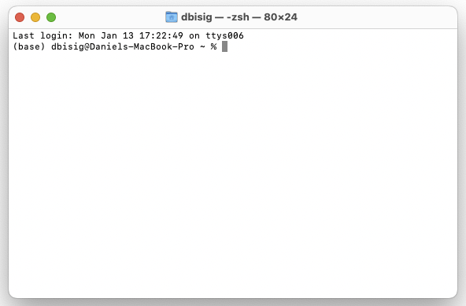
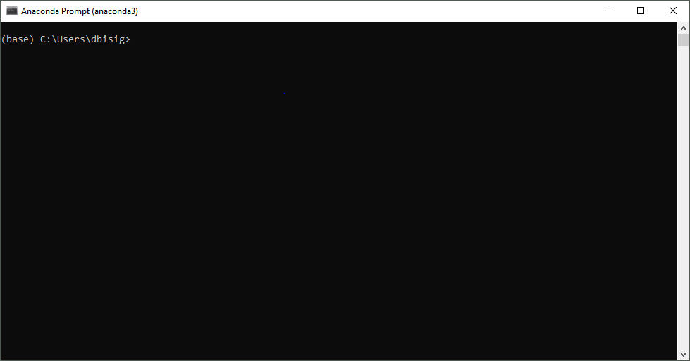

# AI-Toolbox - Installers - Anaconda

Many tools in the AI-Toolbox are written in the Python programming language. Python programs, in particular those that make use of machine learning, are notorious for depending on many Python packages in very specific versions. Anaconda is both a package manager that automatically checks for package dependencies and a tool for creating multiple Python programming environments. These virtual environments are isolated from each other and the operating system which helps to avoid conflicts between Python packages. The AI-Toolbox makes use of Anaconda as package manager and to setup its own dedicated Python programming environment. 

Anaconda can be downloaded for free from [here](https://www.anaconda.com/download/success). The installer for Anaconda can be executed with default options. Once Anaconda has been installed, the Anaconda terminal becomes available. 

Under MacOS, the regular Terminal application is at a same an Anaconda terminal. Accordingly, to start the Anaconda terminal on MacOS, simply start the regular Terminal application. You can verify that this application also behaves as an Anaconda terminal by the presence of the string "(base)" at the beginning of the terminal prompt. Under Windows, the Anaconda terminal is its own application. You can start it from the Start Menu by typing "Anaconda Prompt".

|  |  |
| ------------------------------------------------------------ | ------------------------------------------------------------ |
| The normal Terminal App on MacOS with Anaconda installed.    | The Anaconda Terminal under Windows.                         |

There exist a number of commands that are specific for the Anaconda terminal. These commands are used for creating or deleting environments, installing packages, or conduct other environment specific activities. All these commands start with "conda" and are then followed by keywords and parameters that are specific for each functionality. Included in this repository are two documents that list the most popular conda commands: the document "conda_commands.txt" is a very brief overview of those conda commands are likely useful to install and use the "Premiere" environment. The document "coonda-cheatsheet.pdf" is a more exhaustive overview over all conda commands.

The main Anaconda environment to run Python programs in the AI-Toolbox is named "Premiere". There are three different approaches for creating this environment: creating the environment by executing a script, creating the environment by importing a previously exported environment, creating the environment by manually typing the required conda commands. Each of these approaches is described here.

## Create the Environment by Executing a Script

There exist three installer scripts for setting up the Premiere Anaconda environment.

- premiere_macos_cpu_install.sh
- premiere_windows_cuda11.8_install.bat
- premiere_windows_cpu_install.bat

The shell script entitled "premiere_macos_cpu_install.sh" can be used under MacOS. The batch scripts entitled "premiere_windows_cuda11.8_install.bat" and "premiere_windows_cpu_install.bat" can be used under Windows on PCs that are equipped with a Nvidia GPU or not, respectively. Executing the shell script under MacOS by double clicking on the script file in the Finder is only possible after configuring the Finder to open all files ending on ".sh" with the Terminal App. This can be done by selecting one shell file and change some settings in its corresponding info window (simultaneously press ⌘ and "i" keyboard keys). For the "Open with" application, chose the Terminal.app, and then press the "Change All" button to have this take effect for all shell files. 

## Create the Environment by Importing an Exported Environment

The Premiere Anaconda environment can also be installed from an existing environment that has been exported as a ".yml" file. There such files exist, one for MacOS, one for Windows with GPU support, and one for Windows without GPU support:

- premiere_macos_cpu_install.yml
- premiere_windows_cuda11.8_install.yml
- premiere_windows_cpu_install.yml

To install a new Premiere Anaconda environment from one of these files, proceed as follows.

1. Open an Anaconda Terminal
2. In the terminal, change in the Installer directory of this repository
3. Execute the terminal command: conda env create -f *FILE_NAME* where *FILE_NAME* is replaced with the name of one of the three .yml files mentioned above. 

## Create the Environment Manually

The Premiere Anaconda environment can also be installed manually. This can be useful if the two previously listed installation options don't work or if more flexibility is required in selecting python packages and versions than is possible through an automated installation. The following three files describe the manual installation procedure for MacOS, Windows with GPU support, and Windows without GPU support:

- premiere_macos_cpu_install.txt
- premiere_windows_cuda11.8_install.txt
- premiere_windows_cpu_install.txt

