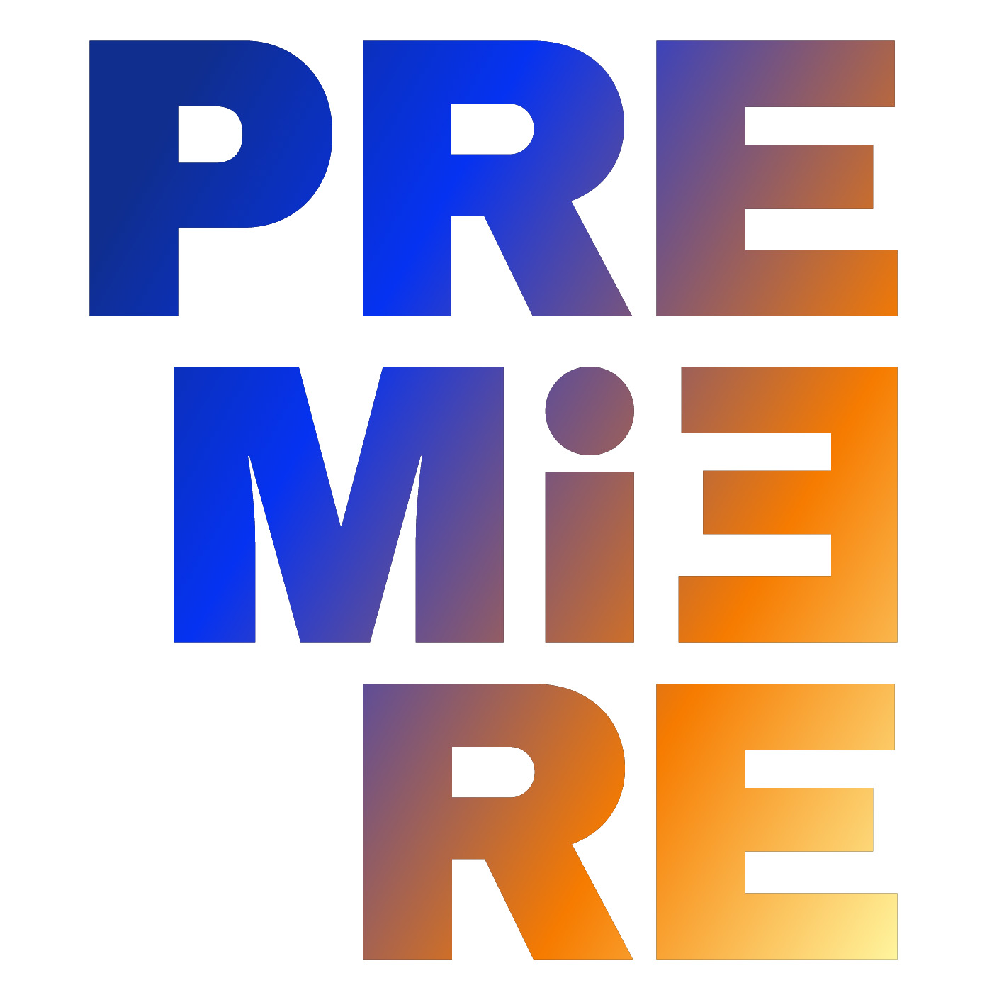

# AI-Toolbox

The AI-Toolbox provides performance artists and companies with intuitive and flexible software tools that facilitate the adoption and integration of AI and VR technologies into the creative process when producing new performance works.  The AI-Toolbox encompasses a variety of machine learning models and rendering methods for creating synthetic media and movement material. These models and methods can be employed in real-time and non-real-time configurations and are therefore suitable both for live performance situations such as during rehearsals and public showings and for non-live planning and conception stages such as during choreographic ideation and creative conception. Furthermore, the algorithms have low computational demands both for training and inference and therefore run on conventional consumer PCs that are accessible to most performance artists. The components follow a modular design approach in that each software tool can run independently or in combination with other tools that may or may not be part of the AI-Toolbox 

The tools provided by the AI-Toolbox can be grouped into different categories. Each category has its own Github repository. The following categories are available:

- Tools in the category "[Motion Utilities](../MotionUtilities)" include: a player for motion capture data, a recorder for sensor data streams, and two converters from proprietary motion capture protocols into the Open Sound Control protocols. 
- Tools in the category "[Motion Analysis](https://github.com/bisnad/MotionAnalysis)” include: three Pose Estimation systems for monocular or stereo video, an analysis tool for deriving motion descriptors, a ML-based motion classifier, a motion clustering tool, and a nearest neighbors motion search and concatenation tool. 
- Tools in the category "[Motion Transformation](https://github.com/bisnad/MotionTransformation)" include: an ML-based tool for transforming and blending motions.
- Tools in the category "[Motion Continuation](https://github.com/bisnad/MotionContinuation)" include: an ML-based tool for continuing motion.
- Tools in the category "[Motion Due](https://github.com/bisnad/MotionDuet)t" include two tools for generating motions for a second dancer in a duet.
- Tools in the category "[Motion Simulation](https://github.com/bisnad/MotionSimulation)" include a tool for simulating motions of non-anthropomorphic morphologies. 
- Tools in the category  “[Motion Sonification](https://github.com/bisnad/MotionSonification)” include: algorithms for physical model synthesis of wind instruments. 
- Tools in the category “[Motion Visualisation](https://github.com/bisnad/MotionVisualisation)” include: a 3d graphics renderer using Raymarching, a ML-based image processing tool using DeepDream.

This Github repository serves as main hub and entry point into the individual tool categories. Furthermore, it provides the following:

- [installation instructions and scripts](https://github.com/bisnad/AIToolbox/tree/main/Installers)
- [links to data files and trained model weights](https://github.com/bisnad/AIToolbox/tree/main/Data) 

In the near future, it will also provide information about performance works that have been created with the aid of the AI-toolbox. 

The AI-Toolbox is being developed within the context of the [Premiere project](https://premiere-project.eu/). Premiere is an EU-funded project that seeks to modernize the performing arts focusing on dance and theater by using advanced digital technologies to support the whole lifecycle of performances: from their production and curation by both amateurs and professionals, to their delivery and understanding from the audience, as well as their analysis and interpretation by art scholars. 

|  |  |
| -----------------------------------------------------------: | :----------------------------------------------------------- |